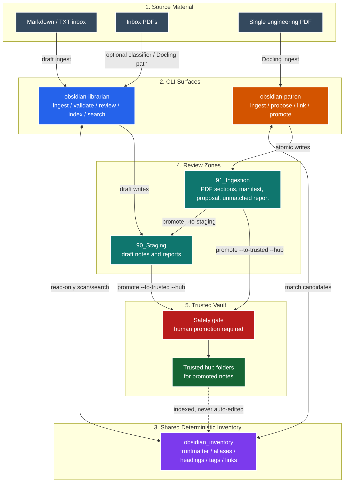
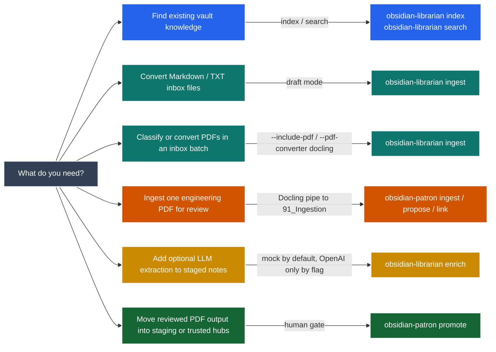

# Obsidian Librarian Agent

Safe, deterministic-first CLI tooling for turning raw files into reviewable
Obsidian notes.

This repository contains two related command-line tools:

| Tool | Role | Writes where |
|---|---|---|
| `obsidian-librarian` | General deterministic inbox ingest, validation, quality review, indexing, search, and optional staged enrichment. | `90_Staging/` in draft mode. |
| `obsidian-patron` | Engineering-PDF intake with Docling, deterministic proposals, match-only wikilinking, unmatched reports, and explicit promotion. | `91_Ingestion/`, then `90_Staging/` or a trusted hub only after `promote`. |

Use `obsidian-librarian` when you want a conservative staged workflow for
Markdown/TXT inboxes and read-only vault search. Use `obsidian-patron` when you
want to convert one engineering PDF into a structured ingestion folder and
manually decide whether it belongs in the vault.

## What It Guarantees

- Raw source files are read-only evidence.
- No deletion behavior is implemented.
- No overwrite by default.
- No network calls, LLM calls, embeddings, OCR, or Agents SDK runtime by default.
- OCR is explicit with `--pdf-ocr`.
- LLM enrichment is explicit with `--extractor openai` or `propose --llm`.
- Trusted vault writes happen only through `obsidian-patron promote`.
- Wikilinking is match-only: the tool never creates stub notes.

## System Map

The diagram uses the same class-based Mermaid style as the
[Insane-Soundbar README](https://github.com/babeinlovexd/Insane-Soundbar/tree/main):
layered subgraphs, colored node classes, and labeled control/data links.



## Install

Use Python 3.10 or newer. On Windows, prefer the `py` launcher if bare
`python` points to an older interpreter.

```powershell
py -3.14 -m pip install -e ".[dev]"
```

Install optional PDF and LLM support only when you need it:

```powershell
py -3.14 -m pip install -e ".[dev,pdf,ocr,llm]"
```

If `python` already points to Python 3.10 or newer, it can replace `py -3.14`
in the commands below.

## Quick Start

From your Obsidian vault root, ingest Markdown/TXT inbox files into staging:

```powershell
obsidian-librarian ingest ./00_Inbox --vault . --mode draft
obsidian-librarian validate ./90_Staging
obsidian-librarian review-quality ./90_Staging
```

Build a deterministic vault index and search it:

```powershell
obsidian-librarian index --vault . --scope vault-and-staging
obsidian-librarian search "your topic" --vault . --scope vault-and-staging
```

Ingest one engineering PDF through Patron:

```powershell
obsidian-patron ingest ./manual.pdf --vault .
obsidian-patron propose manual --vault .
obsidian-patron link manual --vault .
obsidian-patron unmatched manual --vault .
obsidian-patron status manual --vault .
```

After review, promote it:

```powershell
obsidian-patron promote manual --vault . --to-staging
```

Or promote directly to a trusted hub with an explicit hub name:

```powershell
obsidian-patron promote manual --vault . --to-trusted --hub 20_Power-Electronics
```

Reverse a recorded promotion while the `_promotion.json` ledger remains valid:

```powershell
obsidian-patron unpromote manual --vault .
```

## Which Command Should I Use?



## Common Workflows

### 1. Preview an Inbox Without Writing

```powershell
obsidian-librarian ingest ./00_Inbox --vault . --mode read-only
```

Use this first when you want to see what would be processed before creating
staged notes.

### 2. Stage Markdown and TXT Notes

```powershell
obsidian-librarian ingest ./00_Inbox --vault . --mode draft
obsidian-librarian validate ./90_Staging
obsidian-librarian review-quality ./90_Staging
```

Output goes under `90_Staging/`. The command preserves raw source paths and
writes a `review_report.md`.

### 3. Search Vault, Staging, and Ingestion Notes

Available scopes:

| Scope | Includes |
|---|---|
| `vault` | Trusted vault notes only. |
| `staging` | `90_Staging/` only. |
| `ingestion` | `91_Ingestion/` only. |
| `vault-and-staging` | Trusted vault plus staging. |
| `vault-and-ingestion` | Trusted vault plus ingestion. |
| `staging-and-ingestion` | Both review zones. |
| `all` | Trusted vault, staging, and ingestion. |

```powershell
obsidian-librarian index --vault . --scope all
obsidian-librarian search "buck converter" --vault . --scope ingestion
```

### 4. Convert PDFs Through the Librarian Inbox Path

Classify PDFs without conversion:

```powershell
obsidian-librarian ingest ./00_Inbox --vault . --mode draft --include-pdf
```

Use local Docling conversion:

```powershell
obsidian-librarian ingest ./00_Inbox --vault . --mode draft --include-pdf --pdf-converter docling
```

Enable OCR only when the input is scanned and you accept review-required output:

```powershell
obsidian-librarian ingest ./00_Inbox --vault . --mode draft --include-pdf --pdf-converter docling --pdf-ocr
```

Normal Docling conversion forces OCR off. OCR output is marked
`needs_review`.

### 5. Use Patron for Engineering PDFs

The Patron workflow is intentionally review-heavy:

```powershell
obsidian-patron ingest ./Buck_Converter_Handbook.pdf --vault .
obsidian-patron propose buck-converter-handbook --vault .
obsidian-patron link buck-converter-handbook --vault .
obsidian-patron unmatched buck-converter-handbook --vault .
obsidian-patron status buck-converter-handbook --vault .
```

What gets created under `91_Ingestion/<slug>/`:

| File | Purpose |
|---|---|
| `_ingest_manifest.json` | Source hash, provenance, Docling version, run metadata. |
| `00_metadata.md` | Human-readable metadata note. |
| `index.md` | Section table of contents. |
| `01_*.md`, `02_*.md`, ... | Section notes. |
| `_proposal.md` | Deterministic classification/tag proposal and optional LLM proposal text. |
| `_unmatched_candidates.md` | Candidate note queue with frequency, source sections, and context. |
| `_promotion.json` | Created after promotion so `unpromote` can restore the prior location. |

Useful proposal options:

```powershell
obsidian-patron propose buck-converter-handbook --vault . --allow-new-tags
obsidian-patron propose buck-converter-handbook --vault . --llm
obsidian-patron propose buck-converter-handbook --vault . --llm --model gpt-5.4-mini
```

LLM text is proposal-only. It is not inserted into ingested notes.

### 6. Promote Reviewed Patron Output

Promote to staging:

```powershell
obsidian-patron promote buck-converter-handbook --vault . --to-staging
```

Promote to a trusted hub:

```powershell
obsidian-patron promote buck-converter-handbook --vault . --to-trusted --hub 20_Power-Electronics
```

If the deterministic proposal disagrees with the hub, promotion fails unless
you pass `--override`.

```powershell
obsidian-patron promote buck-converter-handbook --vault . --to-trusted --hub 20_Power-Electronics --override
```

## Optional LLM Enrichment

Deterministic behavior is the default. OpenAI enrichment is opt-in.

For staged Markdown notes:

```powershell
obsidian-librarian enrich ./90_Staging --extractor mock --mode read-only
obsidian-librarian enrich ./90_Staging --extractor openai --model gpt-5.4-mini --mode draft
```

For Patron proposals:

```powershell
obsidian-patron propose manual --vault . --llm
```

Set the API key before using OpenAI-backed commands:

```powershell
$env:OPENAI_API_KEY = "your_api_key_here"
```

If the SDK, key, or API call is unavailable, Patron still exits successfully
with the deterministic proposal and a warning.

## Development Checks

Run these before claiming a change is complete:

```powershell
py -3.14 -m pytest
py -3.14 -m ruff check .
py -3.14 -m obsidian_librarian.cli --help
py -3.14 -m obsidian_patron.cli --help
py -3.14 evals/run_evals.py
git diff --check
```

When running directly from an uninstalled checkout, set `PYTHONPATH=src` for
module help checks:

```powershell
$env:PYTHONPATH = "src"
py -3.14 -m obsidian_librarian.cli --help
py -3.14 -m obsidian_patron.cli --help
```

If Windows blocks the default pytest temp path, create a repo-local temp folder:

```powershell
New-Item -ItemType Directory -Force .tmp | Out-Null
py -3.14 -m pytest --basetemp .tmp\pytest-local
```

## Troubleshooting

| Symptom | Likely cause | Fix |
|---|---|---|
| `ImportError` from `datetime.UTC` | Bare `python` is older than Python 3.10. | Use `py -3.14` or install with a Python 3.10+ interpreter. |
| `No module named obsidian_librarian` from checkout | Package is not installed and `src/` is not on `PYTHONPATH`. | Run `py -3.14 -m pip install -e ".[dev]"` or set `PYTHONPATH=src`. |
| `--pdf-converter docling` fails | PDF extra is missing. | Run `py -3.14 -m pip install -e ".[dev,pdf]"`. |
| OCR did not run | OCR is never automatic. | Add `--pdf-ocr` with `--include-pdf --pdf-converter docling`. |
| OpenAI enrichment fails | Missing SDK, API key, or API response issue. | Install `[llm]`, set `OPENAI_API_KEY`, or use deterministic mock/proposal-only mode. |
| Promotion fails due hub mismatch | Proposal and requested trusted hub disagree. | Review `_proposal.md`; use `--override` only when the human decision is intentional. |

## Documentation Map

| Area | File |
|---|---|
| Overview | `docs/00_overview.md` |
| Implementation planning | `docs/10_implementation_plan.md` |
| PDF compatibility planning | `docs/11_pdf_compatibility_plan.md` |
| Usage manual / quick start | `docs/13_usage_manual.md` |
| Phase 11 Patron roadmap | `docs/14_phase_11_obsidian_patron_roadmap.md` |
| Development stack | `docs/20_dev_stack.md` |
| Agent definition | `docs/30_agent_definition.md` |
| Tool contracts | `docs/31_tool_contracts.md` |
| Note schemas | `docs/32_note_schemas.md` |
| Codex workflow | `docs/40_codex_workflow.md` |
| Eval and safety strategy | `docs/50_eval_strategy.md` |
| Reference map | `docs/60_reference_map.md` |
| Visual map | `docs/80_visual_map.md` |

## Development Rule

Build small, safe, and reviewable:

1. deterministic CLI behavior first;
2. staging-only writes unless promotion is explicit;
3. tests before expansion;
4. optional LLM behavior behind flags;
5. PDF/OCR paths behind explicit flags;
6. no autonomous trusted-vault mutation.

## Project Status

Implemented and locally covered:

- deterministic Markdown/TXT inbox ingest;
- staged note validation and deterministic note-quality review;
- deterministic eval runner;
- optional staged LLM enrichment;
- shared vault inventory, index, and search scopes;
- explicit PDF classifier/manifest path;
- optional Docling conversion and explicit OCR path;
- `obsidian-patron` engineering-PDF ingest, proposal, linking, unmatched report,
  status, promotion, and unpromotion.

Deferred by design:

- vector retrieval and embeddings;
- Agents SDK runtime;
- autonomous trusted-vault edits;
- Phase 12 engineering-augmented extraction such as richer equation handling,
  page-level citations, and schematic-aware figure tagging.
