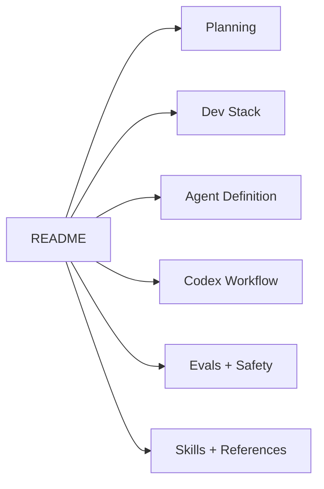

# 00 — Project Overview

## Purpose

Obsidian Librarian Agent is a safe, file-aware assistant for turning raw knowledge fragments into reviewable Obsidian notes.

The first implementation is intentionally small:

- CLI only;
- Markdown/TXT only;
- deterministic processing first;
- write only to `90_Staging/`;
- generate a review report for every ingest run.

## Out of scope for v0.1

- PDF parsing;
- OCR;
- embeddings;
- autonomous vault refactoring;
- LLM extraction;
- Agents SDK runtime;
- Git commits from the tool itself.

## Documentation layers

## Working principle

The project follows the UPE v4.1 deployment style:

- compact always-on instructions;
- deeper reference files only when needed;
- task state for long work;
- eval-driven refinement.
