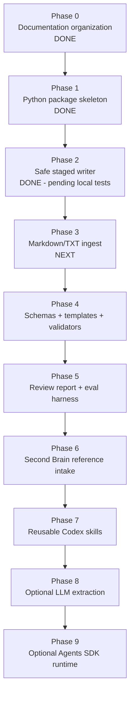

# 10 — Implementation Plan

## Phase map

## Status summary

| Phase | Status | Notes |
|---:|---|---|
| 0 | Done | Documentation organized. |
| 1 | Done | Python package skeleton and safe CLI placeholders added. |
| 2 | Done, pending local test run | Safe staged writer, path checks, no-overwrite behavior, and destructive-write regression tests added. |
| 3 | Next | Markdown/TXT inbox ingest. |
| 4+ | Planned | Validators, evals, Second Brain reference, optional LLM/Agents SDK layers. |

## Phase 0 — Documentation organization

Goal: separate planning, development stack, agent definition, Codex workflow, skills, evals, and references.

Acceptance criteria:

- docs are non-duplicative;
- `AGENTS.md` is short and durable;
- long prompts live in `docs/41_codex_prompts.md`;
- reusable workflows live in `.agents/skills/`.

## Phase 1 — Python package skeleton

Deliverables:

- `pyproject.toml`;
- `src/obsidian_librarian/`;
- minimal CLI help command;
- smoke test.

No LLM, no PDFs, no embeddings.

## Phase 2 — Safe staged writer

Deliverables:

- `src/obsidian_librarian/config.py`;
- `src/obsidian_librarian/vault.py`;
- staging path enforcement;
- overwrite refusal by default;
- explicit overwrite support;
- path traversal tests;
- raw-source preservation tests.

Acceptance criteria:

- valid staged writes land under `90_Staging/`;
- existing staged files are not overwritten by default;
- absolute paths are refused;
- parent traversal is refused;
- raw source fixtures are not modified.

## Phase 3 — Markdown/TXT ingest

Deliverables:

- scan inbox;
- parse `.md` and `.txt`;
- report unsupported extensions;
- generate staged source notes;
- keep runtime deterministic.

Planned files:

- `src/obsidian_librarian/parser.py`;
- `src/obsidian_librarian/renderers.py`;
- `src/obsidian_librarian/review_report.py`;
- CLI integration in `src/obsidian_librarian/cli.py`;
- fixture-based ingest tests.

## Phase 4 — Schemas, templates, validators

Deliverables:

- source note schema;
- atomic note schema;
- action/open-question schema;
- uncertainty entry schema;
- frontmatter validation.

## Phase 5 — Review report and eval harness

Deliverables:

- `review_report.md` for every ingest;
- fixture vault;
- golden eval cases;
- pass/fail eval runner.

## Phase 6 — Second Brain reference intake

Import or summarize the `5-Obsidian-Skills-to-Build-a-Second-Brain` material only when actual content exists in the reference repository.

## Phase 7+ — Advanced layers

Only after deterministic safety works:

- add reusable Codex skills;
- add optional LLM extraction behind an explicit flag;
- add Agents SDK runtime last.
