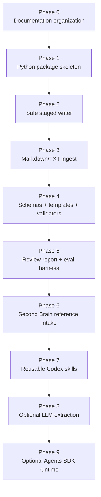

# 10 — Implementation Plan

## Phase map

## Phase 0 — Documentation organization

Goal: separate planning, development stack, agent definition, Codex workflow, skills, evals, and references.

Acceptance criteria:

- docs are non-duplicative;
- `AGENTS.md` is short and durable;
- long prompts live in `docs/41_codex_prompts.md`;
- reusable workflows live in `.agents/skills/`.

## Phase 1 — Python package skeleton

Deliverables:

- `pyproject.toml`;
- `src/obsidian_librarian/`;
- minimal CLI help command;
- smoke test.

No LLM, no PDFs, no embeddings.

## Phase 2 — Safe staged writer

Deliverables:

- vault path adapter;
- staging path enforcement;
- overwrite refusal by default;
- path traversal tests.

## Phase 3 — Markdown/TXT ingest

Deliverables:

- scan inbox;
- parse `.md` and `.txt`;
- report unsupported extensions;
- generate staged source notes.

## Phase 4 — Schemas, templates, validators

Deliverables:

- source note schema;
- atomic note schema;
- TODO/open-question schema;
- conflict entry schema;
- YAML/frontmatter validation.

## Phase 5 — Review report and eval harness

Deliverables:

- `review_report.md` for every ingest;
- fixture vault;
- golden eval cases;
- pass/fail eval runner.

## Phase 6 — Second Brain reference intake

Import or summarize the `5-Obsidian-Skills-to-Build-a-Second-Brain` material only when actual content exists in the reference repository.

## Phase 7+ — Advanced layers

Only after deterministic safety works:

- add reusable Codex skills;
- add optional LLM extraction behind an explicit flag;
- add Agents SDK runtime last.
