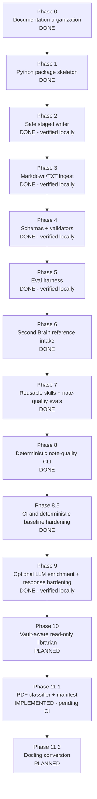

# 10 — Implementation Plan

## Phase map

## Status summary

| Phase | Status | Notes |
|---:|---|---|
| 0 | Done | Documentation organized. |
| 1 | Done | Python package skeleton and safe CLI placeholders added. |
| 2 | Done, verified locally | Safe staged writer, path checks, no-overwrite behavior, and destructive-write regression tests pass locally. |
| 3 | Done, verified locally | Deterministic Markdown/TXT ingest, staged source notes, review report, parser/renderer tests pass locally. |
| 4 | Done, verified locally | Staged-note validation, frontmatter checks, report-skipping behavior, and validation CLI pass locally. |
| 5 | Done, verified locally | Golden eval catalog and deterministic eval runner pass locally. |
| 6 | Done | SB_OS source material inspected; principles, skill review criteria, and deterministic eval ideas integrated without committing raw source. |
| 7 | Done, verified locally | Reusable skills were normalized and Phase 6 note-quality evals were implemented. |
| 8 | Done, verified locally | Deterministic `review-quality` CLI command exposes note-quality review for staged markdown files and directories. |
| 8.5 | Done, verified in CI | GitHub Actions runs deterministic gates: pytest, ruff, CLI help, and eval runner. |
| 9 | Done, verified locally | Optional enrichment command implemented with deterministic mock extraction, optional OpenAI extraction, and response-hardening safeguards. |
| 10 | Planned | Vault-aware read-only librarian next layer: evidence-first ask/reporting over deterministic index/search; optional Agents SDK orchestration remains deferred. |
| 11.0 | Done | PDF compatibility roadmap and contracts merged in PR #10. |
| 11.1 | Implemented on branch, pending CI | PDF discovery, stdlib-only classifier, deterministic manifests, review-report surface, tests, and evals. |
| 11.2 | Planned | Docling digital-PDF conversion to staged Markdown/JSON behind optional dependency group. |

## Phase 0 — Documentation organization

Goal: separate planning, development stack, agent definition, Codex workflow, skills, evals, and references.

Acceptance criteria:

- docs are non-duplicative;
- `AGENTS.md` is short and durable;
- long prompts live in `docs/41_codex_prompts.md`;
- reusable workflows live in `.agents/skills/`.

## Phase 1 — Python package skeleton

Deliverables:

- `pyproject.toml`;
- `src/obsidian_librarian/`;
- minimal CLI help command;
- smoke test.

No LLM, no PDFs, no embeddings.

## Phase 2 — Safe staged writer

Deliverables:

- `src/obsidian_librarian/config.py`;
- `src/obsidian_librarian/vault.py`;
- staging path enforcement;
- overwrite refusal by default;
- explicit overwrite support;
- unique-path staged write helper;
- path traversal tests;
- raw-source preservation tests.

Acceptance criteria:

- valid staged writes land under `90_Staging/`;
- existing staged files are not overwritten by default;
- duplicate generated files get unique names when requested;
- absolute paths are refused;
- parent traversal is refused;
- raw source fixtures are not modified.

## Phase 3 — Markdown/TXT ingest

Deliverables:

- `src/obsidian_librarian/models.py`;
- `src/obsidian_librarian/parser.py`;
- `src/obsidian_librarian/renderers.py`;
- `src/obsidian_librarian/review_report.py`;
- `src/obsidian_librarian/ingest.py`;
- CLI integration in `src/obsidian_librarian/cli.py`;
- parser, renderer, CLI, and ingest tests.

Acceptance criteria:

- scan inbox recursively;
- parse `.md` and `.txt` files;
- report unsupported extensions;
- generate staged source notes;
- generate a staged `review_report.md`;
- read-only mode performs no writes;
- runtime remains deterministic.

## Phase 4 — Schemas and validators

Deliverables:

- staged-note validation in `src/obsidian_librarian/validators.py`;
- simple frontmatter parsing without external dependencies;
- required metadata checks by note type;
- required section checks for source and atomic notes;
- review-report skip behavior;
- validation CLI behavior;
- validator tests.

Acceptance criteria:

- valid generated source notes pass validation;
- missing frontmatter fails validation;
- missing required sections fail validation;
- generated review reports are skipped by note validation;
- `validate` returns non-zero for validation failures.

## Phase 5 — Eval harness

Deliverables:

- `evals/cases.yaml`;
- `evals/run_evals.py`;
- deterministic safety and quality evals;
- eval runner test.

Acceptance criteria:

- evals require no API keys, network access, or model calls;
- evals cover staging-only writes;
- evals cover read-only no-write behavior;
- evals cover duplicate ingest unique paths;
- evals cover unsupported-file reporting;
- evals cover validator failure behavior.

## Phase 6 — Second Brain reference intake

Reference intake is complete pending review.

Deliverables:

- `docs/70_second_brain_reference.md` summarizes the inspected SB_OS material;
- `.agents/skills/second-brain-pattern-review/SKILL.md` defines deterministic review checks;
- `docs/50_eval_strategy.md` records Phase 6 note-quality eval dimensions;
- `evals/cases.yaml` catalogs deterministic Phase 6 eval ideas;
- raw SB_OS source material remains local/reference-only and should not be committed by default.

Acceptance criteria:

- SB_OS source inventory is documented;
- extracted principles map to staged review, provenance, note quality, actionability, retrieval, and link quality;
- non-goals explicitly exclude LLM calls, embeddings, PDF parsing, OCR, MCP, Agents SDK runtime, scheduling, and vault mutation behavior.

## Phase 7 - Reusable skills and deterministic note-quality evals

Goal: make reusable Codex skills operationally useful, non-overlapping, and backed by deterministic quality checks.

Deliverables:

- normalize `.agents/skills/*/SKILL.md` around trigger, inputs, non-actions, workflow, deterministic checks, output format, and eval hooks;
- document skill routing in `docs/42_codex_skills.md`;
- adapt safe SB_OS concepts into project-local review/planning skills under `.agents/skills/sb-os-*`;
- add deterministic note-quality review in `src/obsidian_librarian/note_quality.py`;
- implement the cataloged Phase 6 note-quality evals in `evals/run_evals.py`;
- keep all behavior local, deterministic, and review-only.

Acceptance criteria:

- `obsidian-note-quality` owns structural correctness;
- `second-brain-pattern-review` owns retrieval/usefulness/actionability review;
- missing provenance, missing staged status, missing type, summary overclaiming, and detectable action-collapse are blocking note-quality findings;
- missing links or weak actionability remain suggestions;
- SB_OS-derived skills are project-local only and split active review skills from deferred runtime planning skills;
- no LLM calls, embeddings, MCP, PDF/OCR, Agents SDK runtime, autonomous vault promotion, or deletion behavior are introduced.

## Phase 8 - Deterministic note-quality CLI

Goal: expose deterministic staged-note quality checks as a CLI command with no vault mutation.

Deliverables:

- `obsidian-librarian review-quality <path>` accepts a markdown file or directory (typically `90_Staging/`);
- CLI output includes verdict, checked file count, blocking findings, suggestions, and skipped files;
- exit codes: `0` for no blocking findings, `1` for blocking findings, `2` for invalid path/usage errors;
- deterministic tests and eval coverage for blocking and suggestion behavior.

Acceptance criteria:

- command works for both single file and directory inputs;
- suggestions do not force failure when no blocking findings exist;
- invalid path returns exit code `2`;
- no LLM calls, embeddings, MCP, Agents SDK runtime, PDF/OCR, autonomous vault mutation, or deletion behavior are introduced.

## Phase 8.5 - CI and deterministic baseline hardening

Goal: harden the deterministic baseline before any optional LLM extraction work.

Deliverables:

- add GitHub Actions CI at `.github/workflows/ci.yml`;
- run deterministic checks on each push and pull request (`pytest`, `ruff`, CLI help, eval runner);
- keep runtime deterministic and non-mutating.

Acceptance criteria:

- CI runs on pull requests and pushes to `main`;
- `python -m pytest` passes in CI;
- `python -m ruff check .` passes in CI;
- `python -m obsidian_librarian.cli --help` passes in CI;
- `python evals/run_evals.py` passes in CI.

## Phase 9 - Optional LLM enrichment and response hardening

Goal: add opt-in model-assisted enrichment while preserving deterministic behavior as the default path.

Deliverables:

- `obsidian-librarian enrich <path>` with deterministic `mock` extraction by default;
- optional `openai` extractor behind explicit `--extractor openai` and `OPENAI_API_KEY` requirements;
- extraction schema validation for structured payloads;
- safe handling for incomplete responses, refusals, invalid JSON, and unexpected response shape;
- tests/evals that exercise deterministic mock behavior without live API calls.

Acceptance criteria:

- mock enrichment works without API keys, network access, or model calls;
- OpenAI enrichment is explicit opt-in and fails clearly when dependencies or credentials are missing;
- malformed, incomplete, or refused model responses do not produce trusted enriched notes;
- write-capable enrichment remains staging-only and respects `read-only` vs `draft` mode;
- CI never depends on live OpenAI calls.

## Phase 10 - Vault-aware read-only librarian

Goal: evolve deterministic indexing/search into an evidence-first librarian layer before any orchestration runtime.

Deliverables:

- preserve deterministic `index` and `search` as the base retrieval substrate;
- design or implement read-only ask/reporting behavior over vault and staging scopes;
- include explicit evidence paths, matched fields, searched scope, and confidence/limitation reporting;
- keep Agents SDK orchestration optional and deferred until read-only CLI contracts are stable.

Acceptance criteria:

- default behavior is read-only and non-mutating;
- answers are grounded in indexed vault/staging evidence rather than inferred from missing context;
- output reports searched scope, matched files, and evidence limitations;
- optional Agents SDK runtime, if later added, reuses the same deterministic safety contracts.

## Phase 11 - PDF compatibility

Goal: add PDF-heavy knowledge-base compatibility without weakening deterministic safety, staging-only writes, or provenance requirements.

Source plan: `docs/11_pdf_compatibility_plan.md`.

Subphases:

| Subphase | Status | Purpose |
|---:|---|---|
| 11.0 | Done | Design/spec cleanup and documentation contracts merged in PR #10. |
| 11.1 | Implemented on branch, pending CI | PDF discovery, classifier, and deterministic manifest. |
| 11.2 | Planned | Docling digital-PDF conversion to staged Markdown/JSON. |
| 11.3 | Planned | PDF provenance validators and extraction-quality gates. |
| 11.4 | Done | Table, figure, and asset sidecars. |
| 11.5 | Implemented on branch, pending CI | Table and diagram quality gates. |
| 11.6 | Optional/deferred | Explicit OCR path for scanned PDFs. |

Core constraints:

- PDF intake must be explicit; `.pdf` remains unsupported in default Markdown/TXT ingest until `--include-pdf` is supplied.
- Classifier/manifest behavior lands before full conversion.
- Docling is deferred to Phase 11.2 and must be isolated behind an optional dependency group.
- OCR is deferred to optional Phase 11.6 and must be explicitly enabled; there is no automatic OCR fallback.
- Raw PDFs are immutable evidence inputs and are never modified.
- Generated PDF manifests remain under `90_Staging/pdf/`.

Acceptance criteria for Phase 11.1:

- `.pdf` files remain unsupported unless PDF intake is explicitly enabled;
- `--include-pdf` discovers PDF candidates and classifies them with a stdlib-only probe;
- classifier records source hash, page count, classification, text density, extraction method, and warnings;
- read-only mode creates no staged output;
- draft mode writes manifest JSON sidecars under `90_Staging/pdf/` and review-report entries;
- no PDF-to-Markdown conversion, Docling import, OCR, embeddings, LLM calls, Agents SDK runtime, or source-PDF mutation is introduced;
- pytest and deterministic evals cover the classifier/manifest path.

Acceptance criteria before Phase 11.2 starts:

- Phase 11.1 CI passes;
- manifest schema shape is accepted;
- first real-world PDF fixture set is chosen;
- Docling dependency/version constraints are reviewed;
- implementation remains digital-PDF conversion only, with OCR still deferred.

## Historical implementation context (Phases 8–11)

This project moved from deterministic ingest/validation into staged review quality, optional enrichment, and PDF manifest intake in small slices:

- **Phase 8** introduced deterministic `review-quality` CLI behavior with blocking vs suggestion semantics.
- **Phase 8.5** added CI baseline gates (`pytest`, `ruff`, CLI help, eval runner`) to prevent regressions before LLM-related features.
- **Phase 9** added explicit opt-in enrichment with deterministic mock extraction by default and optional OpenAI structured extraction behind `OPENAI_API_KEY`.
- **Phase 9.1a** hardened OpenAI response parsing for incomplete/refusal/shape-variance cases while preserving deterministic-safe failure behavior and no-write guarantees on extraction failures.
- **Phase 10.0** added a roadmap/design-only plan for a vault-aware read-only librarian with strict scope/evidence reporting and deferred Agents SDK orchestration.
- **Phase 11.0** added PDF compatibility design/spec cleanup.
- **Phase 11.1** adds explicit PDF discovery, stdlib-only classification, deterministic manifest JSON, and eval/test coverage before any Docling conversion.

Key invariant across these phases: deterministic operations remain the baseline; model-assisted or PDF-conversion paths are explicit opt-in and must fail safely without hidden vault mutation.
