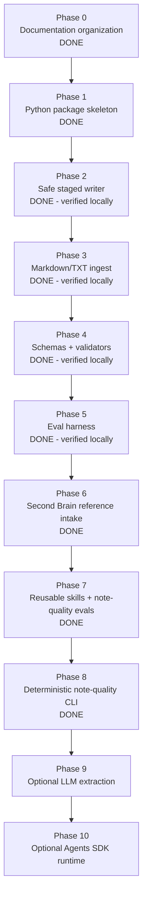

# 10 — Implementation Plan

## Phase map

## Status summary

| Phase | Status | Notes |
|---:|---|---|
| 0 | Done | Documentation organized. |
| 1 | Done | Python package skeleton and safe CLI placeholders added. |
| 2 | Done, verified locally | Safe staged writer, path checks, no-overwrite behavior, and destructive-write regression tests pass locally. |
| 3 | Done, verified locally | Deterministic Markdown/TXT ingest, staged source notes, review report, parser/renderer tests pass locally. |
| 4 | Done, verified locally | Staged-note validation, frontmatter checks, report-skipping behavior, and validation CLI pass locally. |
| 5 | Done, verified locally | Golden eval catalog and deterministic eval runner pass locally. |
| 6 | Done | SB_OS source material inspected; principles, skill review criteria, and deterministic eval ideas integrated without committing raw source. |
| 7 | Done, verified locally | Reusable skills were normalized and Phase 6 note-quality evals were implemented. |
| 8 | Done, verified locally | Deterministic `review-quality` CLI command exposes note-quality review for staged markdown files and directories. |
| 9 | Planned | Optional LLM extraction layer (explicit opt-in only). |
| 10 | Planned | Optional Agents SDK runtime layer. |

## Phase 0 — Documentation organization

Goal: separate planning, development stack, agent definition, Codex workflow, skills, evals, and references.

Acceptance criteria:

- docs are non-duplicative;
- `AGENTS.md` is short and durable;
- long prompts live in `docs/41_codex_prompts.md`;
- reusable workflows live in `.agents/skills/`.

## Phase 1 — Python package skeleton

Deliverables:

- `pyproject.toml`;
- `src/obsidian_librarian/`;
- minimal CLI help command;
- smoke test.

No LLM, no PDFs, no embeddings.

## Phase 2 — Safe staged writer

Deliverables:

- `src/obsidian_librarian/config.py`;
- `src/obsidian_librarian/vault.py`;
- staging path enforcement;
- overwrite refusal by default;
- explicit overwrite support;
- unique-path staged write helper;
- path traversal tests;
- raw-source preservation tests.

Acceptance criteria:

- valid staged writes land under `90_Staging/`;
- existing staged files are not overwritten by default;
- duplicate generated files get unique names when requested;
- absolute paths are refused;
- parent traversal is refused;
- raw source fixtures are not modified.

## Phase 3 — Markdown/TXT ingest

Deliverables:

- `src/obsidian_librarian/models.py`;
- `src/obsidian_librarian/parser.py`;
- `src/obsidian_librarian/renderers.py`;
- `src/obsidian_librarian/review_report.py`;
- `src/obsidian_librarian/ingest.py`;
- CLI integration in `src/obsidian_librarian/cli.py`;
- parser, renderer, CLI, and ingest tests.

Acceptance criteria:

- scan inbox recursively;
- parse `.md` and `.txt` files;
- report unsupported extensions;
- generate staged source notes;
- generate a staged `review_report.md`;
- read-only mode performs no writes;
- runtime remains deterministic.

## Phase 4 — Schemas and validators

Deliverables:

- staged-note validation in `src/obsidian_librarian/validators.py`;
- simple frontmatter parsing without external dependencies;
- required metadata checks by note type;
- required section checks for source and atomic notes;
- review-report skip behavior;
- validation CLI behavior;
- validator tests.

Acceptance criteria:

- valid generated source notes pass validation;
- missing frontmatter fails validation;
- missing required sections fail validation;
- generated review reports are skipped by note validation;
- `validate` returns non-zero for validation failures.

## Phase 5 — Eval harness

Deliverables:

- `evals/cases.yaml`;
- `evals/run_evals.py`;
- deterministic safety and quality evals;
- eval runner test.

Acceptance criteria:

- evals require no API keys, network access, or model calls;
- evals cover staging-only writes;
- evals cover read-only no-write behavior;
- evals cover duplicate ingest unique paths;
- evals cover unsupported-file reporting;
- evals cover validator failure behavior.

## Phase 6 — Second Brain reference intake

Reference intake is complete pending review.

Deliverables:

- `docs/70_second_brain_reference.md` summarizes the inspected SB_OS material;
- `.agents/skills/second-brain-pattern-review/SKILL.md` defines deterministic review checks;
- `docs/50_eval_strategy.md` records Phase 6 note-quality eval dimensions;
- `evals/cases.yaml` catalogs deterministic Phase 6 eval ideas;
- raw SB_OS source material remains local/reference-only and should not be committed by default.

Acceptance criteria:

- SB_OS source inventory is documented;
- extracted principles map to staged review, provenance, note quality, actionability, retrieval, and link quality;
- non-goals explicitly exclude LLM calls, embeddings, PDF parsing, OCR, MCP, Agents SDK runtime, scheduling, and vault mutation behavior.

## Phase 7 - Reusable skills and deterministic note-quality evals

Goal: make reusable Codex skills operationally useful, non-overlapping, and backed by deterministic quality checks.

Deliverables:

- normalize `.agents/skills/*/SKILL.md` around trigger, inputs, non-actions, workflow, deterministic checks, output format, and eval hooks;
- document skill routing in `docs/42_codex_skills.md`;
- adapt safe SB_OS concepts into project-local review/planning skills under `.agents/skills/sb-os-*`;
- add deterministic note-quality review in `src/obsidian_librarian/note_quality.py`;
- implement the cataloged Phase 6 note-quality evals in `evals/run_evals.py`;
- keep all behavior local, deterministic, and review-only.

Acceptance criteria:

- `obsidian-note-quality` owns structural correctness;
- `second-brain-pattern-review` owns retrieval/usefulness/actionability review;
- missing provenance, missing staged status, missing type, summary overclaiming, and detectable action-collapse are blocking note-quality findings;
- missing links or weak actionability remain suggestions;
- SB_OS-derived skills are project-local only and split active review skills from deferred runtime planning skills;
- no LLM calls, embeddings, MCP, PDF/OCR, Agents SDK runtime, autonomous vault promotion, or deletion behavior are introduced.

## Phase 8 - Deterministic note-quality CLI

Goal: expose deterministic staged-note quality checks as a CLI command with no vault mutation.

Deliverables:

- `obsidian-librarian review-quality <path>` accepts a markdown file or directory (typically `90_Staging/`);
- CLI output includes verdict, checked file count, blocking findings, suggestions, and skipped files;
- exit codes: `0` for no blocking findings, `1` for blocking findings, `2` for invalid path/usage errors;
- deterministic tests and eval coverage for blocking and suggestion behavior.

Acceptance criteria:

- command works for both single file and directory inputs;
- suggestions do not force failure when no blocking findings exist;
- invalid path returns exit code `2`;
- no LLM calls, embeddings, MCP, Agents SDK runtime, PDF/OCR, autonomous vault mutation, or deletion behavior are introduced.

## Phase 9-10 - Advanced layers

Only after deterministic safety works:

- Phase 9: add optional LLM extraction behind an explicit flag;
- Phase 10: add optional Agents SDK runtime last.
