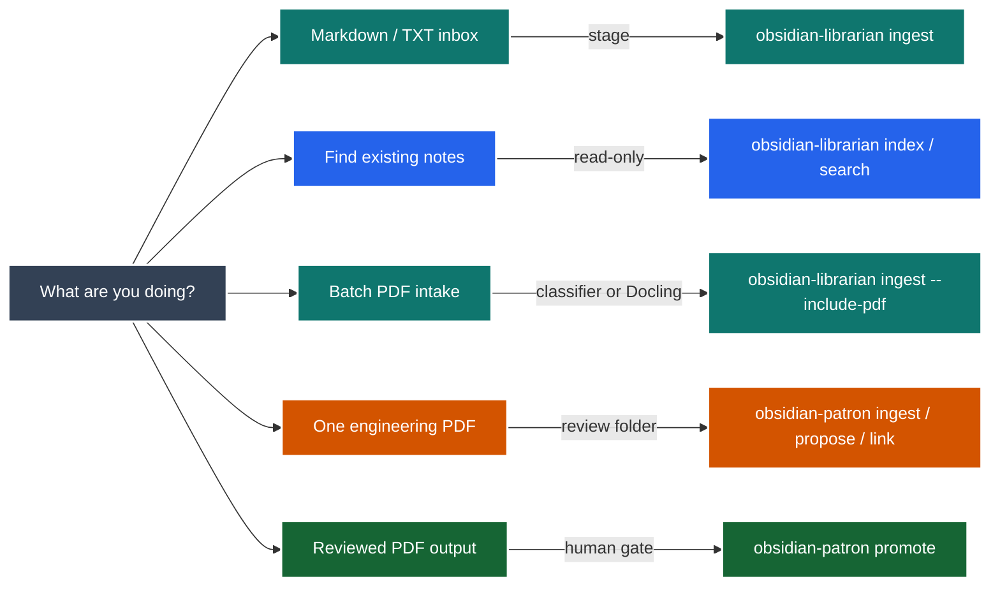
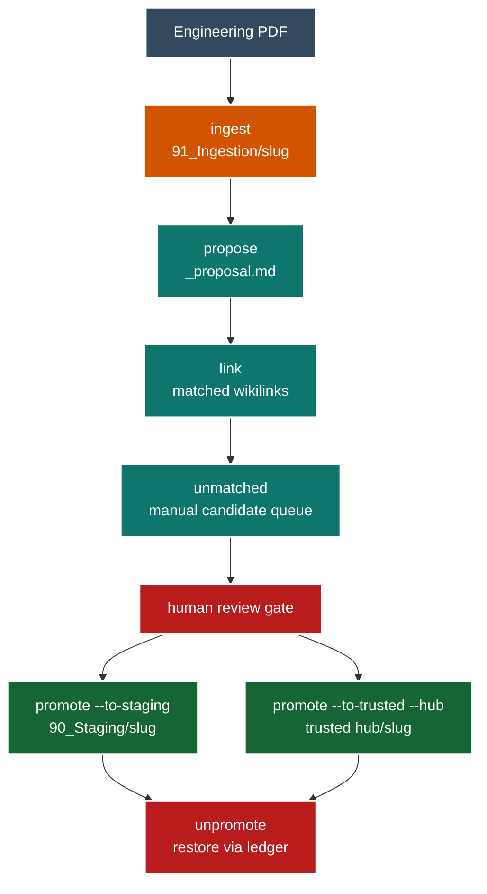

# Obsidian Librarian Usage Guide

This guide explains how to install, run, review, and promote notes with
`obsidian-librarian` and `obsidian-patron`.

Use this document when you want concrete commands and expected outputs. Use the
README for the short project overview.

## Quick Start

The shortest safe path is:

1. Install the package.
2. Put source files in `00_Inbox/`.
3. Ingest into `90_Staging/`.
4. Validate and review staged notes.
5. Search the staged output before moving anything into the permanent vault.

From the repository root:

```powershell
py -3.14 -m pip install -e ".[dev]"
```

From your Obsidian vault root:

```powershell
obsidian-librarian ingest ./00_Inbox --vault . --mode draft
obsidian-librarian validate ./90_Staging
obsidian-librarian review-quality ./90_Staging
obsidian-librarian index --vault . --scope vault-and-staging
obsidian-librarian search "your topic" --vault . --scope vault-and-staging
```

If you only want a dry run:

```powershell
obsidian-librarian ingest ./00_Inbox --vault . --mode read-only
```

## Local GUI

The GUI is a local browser workbench over the existing CLI commands. It does
not replace the CLI and does not duplicate core ingest, search, validation, or
Patron logic.

Start it from a vault or from the repository:

```powershell
obsidian-librarian gui --vault . --host 127.0.0.1 --port 0
```

For scripted smoke checks, suppress browser launch:

```powershell
obsidian-librarian gui --vault . --host 127.0.0.1 --port 0 --no-browser
```

Expected behavior:

- the server binds to `127.0.0.1` by default;
- the startup output prints the local URL and a per-session token;
- every GUI action displays the exact equivalent CLI command;
- read-only actions can run immediately;
- staging writes, Patron ingestion, promotion, OCR, and LLM paths are explicit;
- raw source files are never modified by the GUI layer.

## Tool Choice

| Need | Command family | Writes |
|---|---|---|
| Stage Markdown or TXT inbox files | `obsidian-librarian ingest` | `90_Staging/` in `draft` mode |
| Validate staged notes | `obsidian-librarian validate` | No writes |
| Review note quality | `obsidian-librarian review-quality` | No writes |
| Search trusted, staged, or ingestion notes | `obsidian-librarian index` and `search` | No writes |
| Optionally enrich staged notes | `obsidian-librarian enrich` | Only in `draft` mode |
| Ingest one engineering PDF | `obsidian-patron ingest` | `91_Ingestion/<slug>/` |
| Propose tags, hub, links, and review notes | `obsidian-patron propose` and `link` | Proposal and unmatched report under `91_Ingestion/<slug>/` |
| Promote reviewed PDF output | `obsidian-patron promote` | `90_Staging/` or trusted hub |



## Repository Setup

Install normal development dependencies:

```powershell
py -3.14 -m pip install -e ".[dev]"
```

Install PDF support when you want Docling conversion:

```powershell
py -3.14 -m pip install -e ".[dev,pdf]"
```

Install OCR and LLM support only when you need those explicit opt-in paths:

```powershell
py -3.14 -m pip install -e ".[dev,pdf,ocr,llm]"
```

The project requires Python 3.10 or newer. On this Windows machine, bare
`python` may point to Python 3.9, so use `py -3.14` unless you have confirmed
that `python --version` is new enough.

If running module commands from an uninstalled checkout:

```powershell
$env:PYTHONPATH = "src"
py -3.14 -m obsidian_librarian.cli --help
py -3.14 -m obsidian_patron.cli --help
```

## Vault Layout

A typical vault layout:

```text
.
|-- 00_Inbox/
|   |-- notes-from-chat.md
|   |-- support-log.txt
|   `-- Buck_Converter_Handbook.pdf
|-- 20_Power-Electronics/
|-- 30_DSP/
|-- 90_Staging/
`-- 91_Ingestion/
```

Important folders:

| Folder | Meaning |
|---|---|
| `00_Inbox/` | Raw files waiting to be staged. |
| `90_Staging/` | Review zone for generated notes and reports. |
| `91_Ingestion/` | Review zone for Patron engineering-PDF output. |
| Trusted hub folders | Your permanent vault structure, for example `20_Power-Electronics/`. |

## Workflow 1: Stage Markdown and TXT Files

Preview first:

```powershell
obsidian-librarian ingest ./00_Inbox --vault . --mode read-only
```

Write staged output:

```powershell
obsidian-librarian ingest ./00_Inbox --vault . --mode draft
```

Expected output:

- staged notes under `90_Staging/`;
- provenance fields in generated frontmatter;
- `review_report.md` under `90_Staging/`;
- raw source files left untouched.

Example source file:

```markdown
# Inverter Test Notes

The inverter clips above 4.2 kW during late afternoon load tests.

Decision: keep the existing controller limit for the next test run.
```

Expected staged note shape:

```markdown
---
type: "source"
source_kind: "markdown"
source_path: "00_Inbox/Inverter Test Notes.md"
status: "staged"
confidence: "medium"
---

# Inverter Test Notes

...
```

## Workflow 2: Validate and Review Staged Notes

Run structural validation:

```powershell
obsidian-librarian validate ./90_Staging
```

Run deterministic quality checks:

```powershell
obsidian-librarian review-quality ./90_Staging
```

Use the results as a review checklist:

| Result type | What to do |
|---|---|
| Missing required frontmatter | Fix before promotion. |
| Wrong staged status | Fix before promotion. |
| Weak title or body structure | Improve manually in staging. |
| Missing provenance | Do not promote until the source is traceable. |

## Workflow 3: Index and Search

Build an index:

```powershell
obsidian-librarian index --vault . --scope vault-and-staging
```

Search:

```powershell
obsidian-librarian search "inverter clipping" --vault . --scope vault-and-staging
```

Search only newly staged notes:

```powershell
obsidian-librarian search "controller limit" --vault . --scope staging
```

Search Patron PDF intake output:

```powershell
obsidian-librarian search "buck converter" --vault . --scope ingestion
```

Available scopes:

| Scope | Includes |
|---|---|
| `vault` | Trusted vault notes only. |
| `staging` | `90_Staging/` only. |
| `ingestion` | `91_Ingestion/` only. |
| `vault-and-staging` | Trusted vault plus `90_Staging/`. |
| `vault-and-ingestion` | Trusted vault plus `91_Ingestion/`. |
| `staging-and-ingestion` | Both review zones. |
| `all` | Trusted vault, staging, and ingestion. |

## Workflow 4: Batch PDF Intake With Librarian

Classify PDFs and write manifests without Docling conversion:

```powershell
obsidian-librarian ingest ./00_Inbox --vault . --mode draft --include-pdf
```

Convert digital PDFs with Docling:

```powershell
obsidian-librarian ingest ./00_Inbox --vault . --mode draft --include-pdf --pdf-converter docling
```

Enable OCR only for scanned PDFs:

```powershell
obsidian-librarian ingest ./00_Inbox --vault . --mode draft --include-pdf --pdf-converter docling --pdf-ocr
```

Expected output for Docling conversion:

```text
90_Staging/
`-- pdf/
    `-- Buck_Converter_Handbook/
        |-- manifest.json
        |-- source.md
        |-- docling.json
        |-- tables.json
        `-- assets/
```

Rules:

- PDF intake is ignored unless `--include-pdf` is present.
- Normal Docling conversion forces OCR off.
- OCR requires `--pdf-ocr` and marks output as `needs_review`.
- Source PDFs are not modified.

## Workflow 5: Engineering PDF Intake With Patron

Use Patron when you want one engineering PDF split into reviewable section
notes before promotion.

```powershell
obsidian-patron ingest ./Buck_Converter_Handbook.pdf --vault .
```

The slug is derived from the PDF filename. For
`Buck_Converter_Handbook.pdf`, use:

```powershell
obsidian-patron propose buck-converter-handbook --vault .
obsidian-patron link buck-converter-handbook --vault .
obsidian-patron unmatched buck-converter-handbook --vault .
obsidian-patron status buck-converter-handbook --vault .
```

Expected output:

```text
91_Ingestion/
`-- buck-converter-handbook/
    |-- _ingest_manifest.json
    |-- 00_metadata.md
    |-- index.md
    |-- 01_*.md
    |-- 02_*.md
    |-- _proposal.md
    `-- _unmatched_candidates.md
```

What each file is for:

| File | Purpose |
|---|---|
| `_ingest_manifest.json` | Source hash, provenance, Docling version, run metadata. |
| `00_metadata.md` | Human-readable intake metadata. |
| `index.md` | Table of contents for generated sections. |
| `01_*.md`, `02_*.md` | Section notes with source provenance. |
| `_proposal.md` | Deterministic hub, tag, and optional LLM proposal. |
| `_unmatched_candidates.md` | Manual queue of possible note targets. |

Patron lifecycle:



## Workflow 6: Proposal Options

Default deterministic proposal:

```powershell
obsidian-patron propose buck-converter-handbook --vault .
```

Allow tags that do not already exist in the vault:

```powershell
obsidian-patron propose buck-converter-handbook --vault . --allow-new-tags
```

Add optional LLM text to the proposal only:

```powershell
$env:OPENAI_API_KEY = "your_api_key_here"
obsidian-patron propose buck-converter-handbook --vault . --llm
```

Choose a model:

```powershell
obsidian-patron propose buck-converter-handbook --vault . --llm --model gpt-5.4-mini
```

Rules:

- LLM text is written only to `_proposal.md`.
- LLM text is not inserted into generated section notes.
- If the SDK, key, or API call fails, Patron still returns the deterministic
  proposal and records a warning.

## Workflow 7: Wikilinks and Unmatched Candidates

Run linking:

```powershell
obsidian-patron link buck-converter-handbook --vault .
```

Print unmatched candidates:

```powershell
obsidian-patron unmatched buck-converter-handbook --vault .
```

The linker matches only against existing vault inventory:

- exact note titles;
- aliases from frontmatter;
- unique, conservative heading matches.

It does not create new notes. Use `_unmatched_candidates.md` as a manual queue.

Example unmatched entry shape:

```markdown
## Flux Capacitor

- frequency: 3
- source_sections: Chapter One, Chapter Two
- example: The Flux Capacitor regulates...
```

## Workflow 8: Promote and Unpromote Patron Output

Promote to staging:

```powershell
obsidian-patron promote buck-converter-handbook --vault . --to-staging
```

Promote to a trusted hub:

```powershell
obsidian-patron promote buck-converter-handbook --vault . --to-trusted --hub 20_Power-Electronics
```

If the proposal hub does not match your requested hub, promotion fails unless
you intentionally override:

```powershell
obsidian-patron promote buck-converter-handbook --vault . --to-trusted --hub 20_Power-Electronics --override
```

Reverse a recorded promotion:

```powershell
obsidian-patron unpromote buck-converter-handbook --vault .
```

`unpromote` uses `_promotion.json`. Manual recovery is required if the ledger is
missing, corrupted, or the original destination is occupied.

## Workflow 9: Optional Staged LLM Enrichment

Use the deterministic mock extractor first:

```powershell
obsidian-librarian enrich ./90_Staging --extractor mock --mode read-only
```

Write enriched staged drafts:

```powershell
obsidian-librarian enrich ./90_Staging --extractor mock --mode draft
```

Use OpenAI explicitly:

```powershell
$env:OPENAI_API_KEY = "your_api_key_here"
obsidian-librarian enrich ./90_Staging --extractor openai --model gpt-5.4-mini --mode draft
```

Rules:

- `read-only` mode performs no writes.
- `draft` mode writes staged enriched output.
- Live OpenAI calls are never part of the deterministic default path.

## Practical Examples

### Example A: Process Meeting Notes

```powershell
New-Item -ItemType Directory -Force ./00_Inbox | Out-Null
Set-Content ./00_Inbox/2026-05-30_inverter-review.md @"
# Inverter Review

Finding: controller clipping appears at high load.
Decision: keep the limit for the next test.
"@

obsidian-librarian ingest ./00_Inbox --vault . --mode draft
obsidian-librarian validate ./90_Staging
obsidian-librarian search "controller clipping" --vault . --scope staging
```

### Example B: Inspect a PDF Without OCR

```powershell
obsidian-librarian ingest ./00_Inbox --vault . --mode draft --include-pdf --pdf-converter docling
obsidian-librarian validate ./90_Staging/pdf
```

Check the generated `manifest.json` and confirm `ocr_enabled` is `false`.

### Example C: Ingest a Datasheet With Patron

```powershell
obsidian-patron ingest ./IR2110_Datasheet.pdf --vault .
obsidian-patron propose ir2110-datasheet --vault .
obsidian-patron link ir2110-datasheet --vault .
obsidian-patron unmatched ir2110-datasheet --vault .
obsidian-patron promote ir2110-datasheet --vault . --to-trusted --hub 20_Power-Electronics
```

Review `_proposal.md` before the final `promote` command.

### Example D: Review Only Ingestion Notes

```powershell
obsidian-librarian index --vault . --scope ingestion
obsidian-librarian search "gate driver" --vault . --scope ingestion
```

### Example E: Re-run Patron Ingest Intentionally

If a slug already exists, Patron refuses to overwrite. Use `--force` only when
you intentionally want to archive the previous ingestion folder and regenerate:

```powershell
obsidian-patron ingest ./Buck_Converter_Handbook.pdf --vault . --force
```

## Troubleshooting

| Symptom | Likely cause | Fix |
|---|---|---|
| `ImportError` from `datetime.UTC` | Python is older than 3.10. | Use `py -3.14` or another Python 3.10+ interpreter. |
| `No module named obsidian_librarian` | Package is not installed and `src/` is not on `PYTHONPATH`. | Install editable mode or set `$env:PYTHONPATH = "src"`. |
| No notes are written | Command ran in `read-only` mode. | Re-run with `--mode draft` when you are ready to write staged output. |
| PDFs are ignored | `--include-pdf` is missing. | Add `--include-pdf`. |
| Docling conversion fails | PDF extra is not installed. | Install with `py -3.14 -m pip install -e ".[dev,pdf]"`. |
| OCR did not run | OCR is explicit only. | Add `--pdf-ocr` with `--include-pdf --pdf-converter docling`. |
| Patron cannot find slug | Slug differs from your guess. | Check the `Ingested:` line or list `91_Ingestion/`. |
| Promotion fails due hub mismatch | Proposal and requested hub disagree. | Review `_proposal.md`; use `--override` only after human review. |
| `unpromote` fails | Ledger missing or destination occupied. | Restore manually or clear the conflicting destination after review. |

## Review Checklist

Before moving generated notes into trusted vault folders:

1. `obsidian-librarian validate` reports no blocking issues.
2. `obsidian-librarian review-quality` has no blocking findings.
3. Search returns the expected staged or ingestion notes.
4. Generated notes include source provenance.
5. For PDFs, manifests correctly report conversion method and OCR status.
6. `_proposal.md` has been reviewed by a human.
7. `_unmatched_candidates.md` has been reviewed as a manual note-creation queue.
8. Trusted promotion uses an explicit hub and, when needed, an intentional
   `--override`.

## Developer Verification

For documentation-only changes, run at least:

```powershell
py -3.14 -m obsidian_librarian.cli --help
py -3.14 -m obsidian_patron.cli --help
git diff --check
```

For code changes, run the full local checks:

```powershell
New-Item -ItemType Directory -Force .tmp | Out-Null
py -3.14 -m pytest --basetemp .tmp\pytest-local
py -3.14 -m ruff check .
py -3.14 evals/run_evals.py
git diff --check
```
