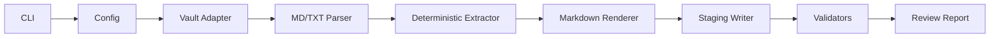

# 20 — Development Stack

## v0.1 target

The first implementation is a deterministic Python CLI. It should work without API keys, network access, embeddings, or model calls.

## Recommended stack

| Layer | Choice | Reason |
|---|---|---|
| Language | Python | Fast filesystem tooling and CLI development. |
| CLI | `argparse` first, optional `typer` later | Avoid dependency bloat in v0.1. |
| Package manager | `uv` or standard `pip` | Keep local setup simple. |
| Tests | `pytest` | Required for safety gates. |
| Lint/format | `ruff` | Fast, low-friction checks. |
| Templates | simple string templates first | Jinja2 can be added later if needed. |
| Metadata | YAML frontmatter | Obsidian-compatible note metadata. |
| Storage | filesystem only | No DB in v0.1. |
| LLM | disabled by default | Add only after deterministic core is safe. |
| Agents SDK | not in v0.1 | Add only after CLI/evals are stable. |

## Proposed package modules

```text
src/obsidian_librarian/
├─ __init__.py
├─ cli.py
├─ config.py
├─ models.py
├─ vault.py
├─ parser.py
├─ classifier.py
├─ extractor.py
├─ renderers.py
├─ validators.py
└─ review_report.py
```

## Runtime flow



## Non-goals for the first code phase

- no direct vault-wide mutation;
- no PDF parsing;
- no OCR;
- no embeddings;
- no web access;
- no Agents SDK runtime;
- no autonomous Git commits.
