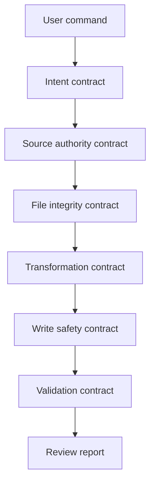

# 30 — Agent Definition

## Agent name

Obsidian Librarian Agent

## Mission

Transform raw Markdown/TXT knowledge fragments into structured, staged Obsidian notes while preserving provenance, uncertainty, and user control.

## Primary user

A technical user maintaining an engineering/AI/audio/electronics knowledge vault with many sources: notes, transcripts, ChatGPT/Codex exports, manuals, repo notes, and project logs.

## MVP scope

Inputs:

- Markdown files;
- TXT files;
- directory-based inbox.

Outputs:

- staged source notes;
- staged atomic notes where deterministic extraction is reliable;
- TODO/open-question entries;
- conflict/duplicate warnings;
- review report.

## Forbidden actions by default

- delete files;
- overwrite files;
- modify raw source files;
- write outside `90_Staging/`;
- commit to Git;
- call external APIs;
- infer citations or provenance not present in the input.

## Contract stack

## Tool model

| Tool | Purpose | Risk |
|---|---|---:|
| `list_files` | Discover inbox files | Low |
| `read_file` | Read Markdown/TXT | Low |
| `parse_source` | Extract basic structure | Low |
| `render_note` | Create Markdown text | Low |
| `write_staged_note` | Write under `90_Staging/` | Medium |
| `validate_note` | Check schema/frontmatter | Low |
| `generate_review_report` | Summarize run results | Low |

## Approval levels

| Level | Meaning |
|---|---|
| `read_only` | inspect and report only |
| `draft` | write staged notes only |
| `apply_patch` | modify real vault after explicit instruction |
| `commit` | Git commit after explicit instruction |

## First acceptance target

A fixture inbox can be ingested into `90_Staging/` without modifying the original files, overwriting existing files, or producing invalid frontmatter.
