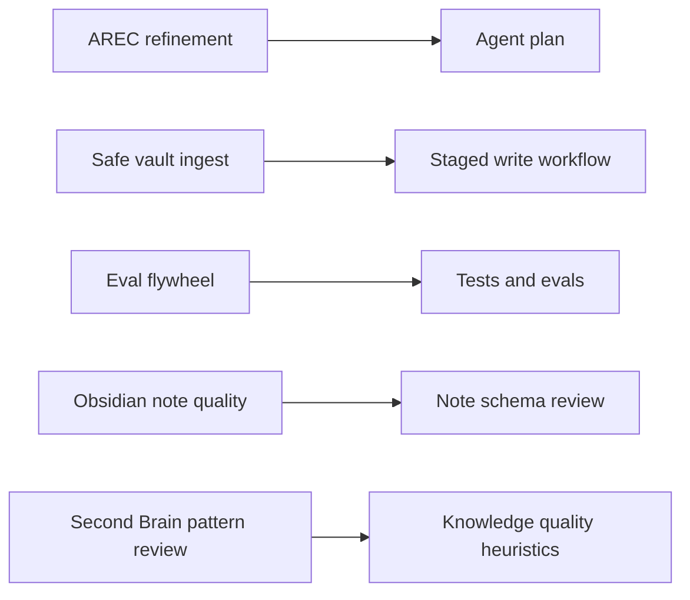

# 42 — Codex Skills

This document lists reusable development workflows for the Obsidian Librarian project.

## Skill map

## Reusable skills

| Skill | Path | Purpose |
|---|---|---|
| AREC Agent Refinement | `.agents/skills/arec-agent-refinement/SKILL.md` | Convert agent ideas into plans, contracts, evals, and Codex prompts. |
| Safe Vault Ingest | `.agents/skills/safe-vault-ingest/SKILL.md` | Enforce read/write safety for vault ingestion workflows. |
| Eval Flywheel | `.agents/skills/eval-flywheel/SKILL.md` | Convert repeated failures into tests, evals, docs, or instruction updates. |
| Obsidian Note Quality | `.agents/skills/obsidian-note-quality/SKILL.md` | Review structural correctness: frontmatter, note type, status, required sections, and provenance. |
| Second Brain Pattern Review | `.agents/skills/second-brain-pattern-review/SKILL.md` | Review knowledge usefulness: retrieval, actionability, link quality, and avoiding knowledge hoarding. |

## Routing matrix

| User or Codex task | Skill |
|---|---|
| New agent idea | `arec-agent-refinement` |
| Ingest safety or staged writes | `safe-vault-ingest` |
| Repeated bug, safety miss, or quality failure | `eval-flywheel` |
| Obsidian note structure and schema correctness | `obsidian-note-quality` |
| Retrieval, usefulness, link quality, or actionability | `second-brain-pattern-review` |
| Vault scaffold readiness review | `sb-os-vault-scaffold-review` |
| Read-only vault or staged-note audit | `sb-os-vault-audit` |
| Future operator design | `sb-os-operator-planning` |
| Future team sharing design | `sb-os-team-sharing-plan` |
| Future MCP architecture | `sb-os-mcp-planning` |

## SB_OS-derived project-local skills

These skills adapt safe patterns from `SB_OS/skills` into Obsidian Librarian workflows. They are project-local under `.agents/skills/`; they are not installed globally and they do not execute raw SB_OS automation.

| Skill | Source inspiration | Current mode | Boundary |
|---|---|---|---|
| `sb-os-vault-scaffold-review` | `SB_OS/skills/os-setup` | Active review skill | Inspect and report only; no vault bootstrap or template copy. |
| `sb-os-vault-audit` | `SB_OS/skills/os-optimizer` | Active review skill | Findings and eval hooks only; no auto-fixes or reorganization. |
| `sb-os-operator-planning` | `SB_OS/skills/os-operator` | Deferred planning skill | No scheduling, connectors, messages, or recurring jobs. |
| `sb-os-team-sharing-plan` | `SB_OS/skills/team-os` | Deferred planning skill | No Relay install, plugin changes, sync, or permissions changes. |
| `sb-os-mcp-planning` | `SB_OS/skills/os-mcp` | Deferred planning skill | No server code, tokens, deployment, or MCP runtime dependencies. |

## Boundary between note-quality skills

`obsidian-note-quality` checks whether a generated note is structurally valid for the deterministic CLI.

`second-brain-pattern-review` checks whether a generated note will be useful later as knowledge: findable, actionable, linked where helpful, and not just another undigested source dump.

## Rule

Use skills only for repeated workflows. Keep durable repository instructions short.
