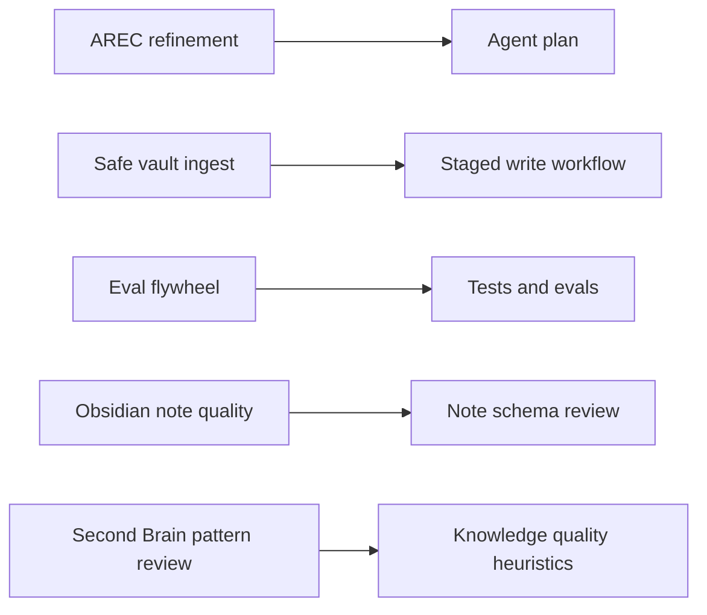

# 42 — Codex Skills

This document lists reusable development workflows for the Obsidian Librarian project.

## Skill map

## Planned skills

| Skill | Path | Purpose |
|---|---|---|
| AREC Agent Refinement | `.agents/skills/arec-agent-refinement/SKILL.md` | Convert agent ideas into plans, contracts, evals, and Codex prompts. |
| Safe Vault Ingest | `.agents/skills/safe-vault-ingest/SKILL.md` | Enforce read/write safety for vault ingestion workflows. |
| Eval Flywheel | `.agents/skills/eval-flywheel/SKILL.md` | Convert repeated failures into tests, evals, docs, or instruction updates. |
| Obsidian Note Quality | `.agents/skills/obsidian-note-quality/SKILL.md` | Review frontmatter, links, provenance, note types, and usefulness. |
| Second Brain Pattern Review | `.agents/skills/second-brain-pattern-review/SKILL.md` | Apply summarized Second Brain/PKM heuristics after reference material exists. |

## Rule

Use skills only for repeated workflows. Keep durable repository instructions short.
