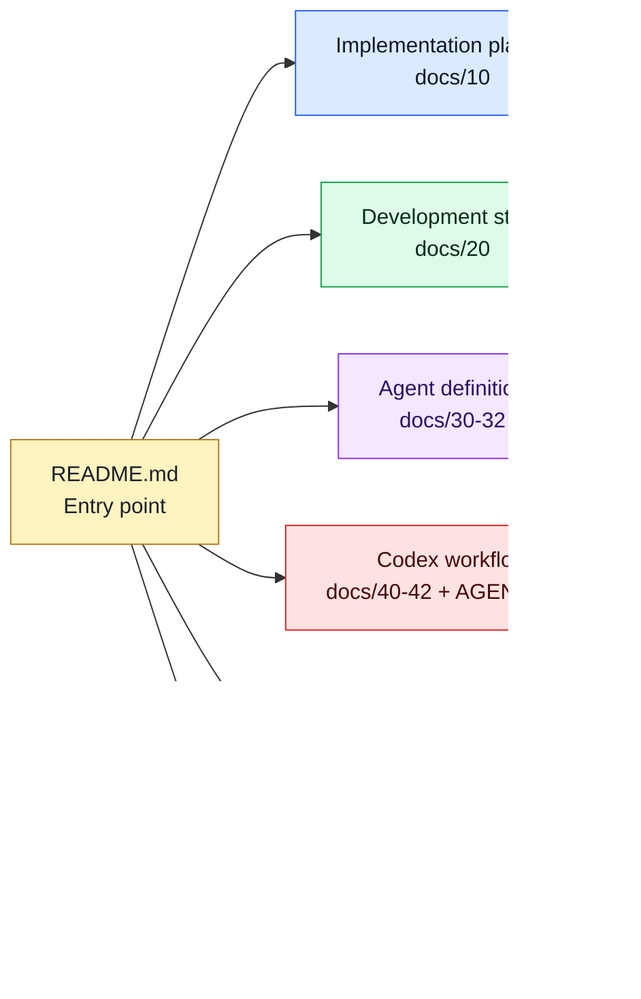
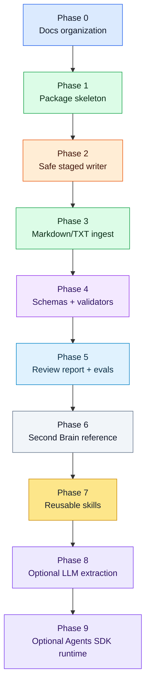

# 80 — Visual Map

This page keeps the documentation structure visible and reduces instruction overload.

## Documentation architecture

```mermaid
flowchart LR
    README[README.md<br/>Entry point]:::core

    README --> PLAN[Implementation planning<br/>docs/10]:::planning
    README --> DEV[Development stack<br/>docs/20]:::dev
    README --> AGENT[Agent definition<br/>docs/30-32]:::agent
    README --> CODEX[Codex workflow<br/>docs/40-42 + AGENTS.md]:::codex
    README --> EVALS[Evals and safety<br/>docs/50]:::evals
    README --> REFS[References<br/>docs/60-70]:::refs

    classDef core fill:#fff3bf,stroke:#b7791f,color:#1a202c;
    classDef planning fill:#dbeafe,stroke:#2563eb,color:#0f172a;
    classDef dev fill:#dcfce7,stroke:#16a34a,color:#052e16;
    classDef agent fill:#f3e8ff,stroke:#9333ea,color:#2e1065;
    classDef codex fill:#fee2e2,stroke:#dc2626,color:#450a0a;
    classDef evals fill:#e0f2fe,stroke:#0284c7,color:#082f49;
    classDef refs fill:#f1f5f9,stroke:#64748b,color:#0f172a;
```

## Implementation path

```mermaid
flowchart TD
    P0[Phase 0<br/>Docs organization]:::planning
    P1[Phase 1<br/>Package skeleton]:::dev
    P2[Phase 2<br/>Safe staged writer]:::safety
    P3[Phase 3<br/>Markdown/TXT ingest]:::dev
    P4[Phase 4<br/>Schemas + validators]:::agent
    P5[Phase 5<br/>Review report + evals]:::evals
    P6[Phase 6<br/>Second Brain reference]:::refs
    P7[Phase 7<br/>Reusable skills]:::skills
    P8[Phase 8<br/>Optional LLM extraction]:::advanced
    P9[Phase 9<br/>Optional Agents SDK runtime]:::advanced

    P0 --> P1 --> P2 --> P3 --> P4 --> P5 --> P6 --> P7 --> P8 --> P9

    classDef planning fill:#dbeafe,stroke:#2563eb,color:#0f172a;
    classDef dev fill:#dcfce7,stroke:#16a34a,color:#052e16;
    classDef safety fill:#ffedd5,stroke:#ea580c,color:#431407;
    classDef agent fill:#f3e8ff,stroke:#9333ea,color:#2e1065;
    classDef evals fill:#e0f2fe,stroke:#0284c7,color:#082f49;
    classDef refs fill:#f1f5f9,stroke:#64748b,color:#0f172a;
    classDef skills fill:#fde68a,stroke:#ca8a04,color:#1a202c;
    classDef advanced fill:#ede9fe,stroke:#7c3aed,color:#2e1065;
```

## Runtime data flow

```mermaid
flowchart LR
    CLI[CLI]:::dev --> CFG[Config]:::dev
    CFG --> VAULT[Vault adapter]:::safety
    VAULT --> PARSER[MD/TXT parser]:::dev
    PARSER --> EXTRACT[Extractor]:::agent
    EXTRACT --> RENDER[Renderer]:::agent
    RENDER --> STAGE[Staging writer]:::safety
    STAGE --> VALIDATE[Validators]:::evals
    VALIDATE --> REPORT[Review report]:::evals
    REPORT --> HUMAN[Human review]:::core

    classDef core fill:#fff3bf,stroke:#b7791f,color:#1a202c;
    classDef dev fill:#dcfce7,stroke:#16a34a,color:#052e16;
    classDef safety fill:#ffedd5,stroke:#ea580c,color:#431407;
    classDef agent fill:#f3e8ff,stroke:#9333ea,color:#2e1065;
    classDef evals fill:#e0f2fe,stroke:#0284c7,color:#082f49;
```
