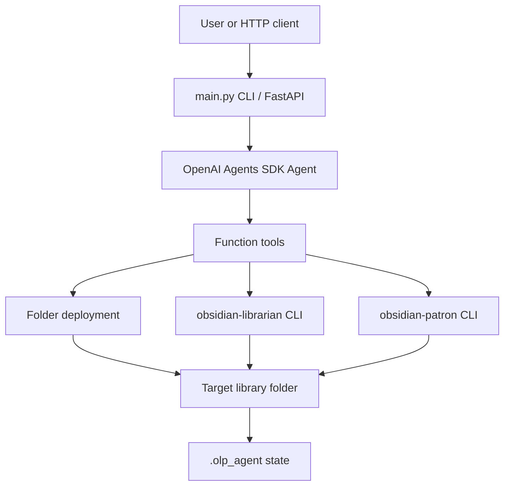

# Architecture

The app has two paths:

- Deterministic local path: `health`, `deploy-library`, `scan-library`, `classify-library`, and `plan-wave` run without an OpenAI API key.
- Live agent path: `run` and `POST /run` use `Agent`, `Runner.run`, local function tools, and typed `AgentResult`.

The tool implementation is kept outside the SDK decorator layer so tests and evals can call the same functions directly.
